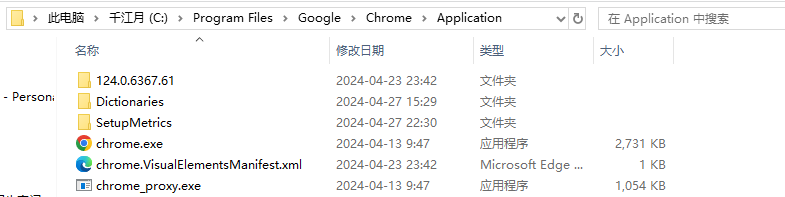
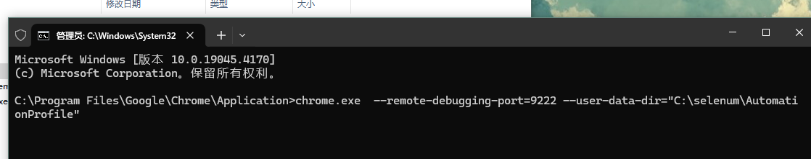
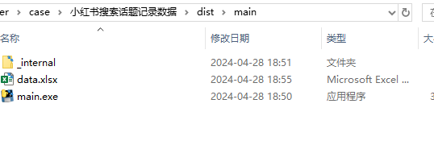

# 代码运行步骤

1. 下载chrome浏览器

2. 进入chrome.exe所在的目录

3. 启动cmd命令行，运行运行chrome.exe --remote-debugging-port=9222 --user-data-dir="C:\selenum\AutomationProfile"

4. 等待浏览器启动后，双击运行main.exe
根据提示输入相关信息
5. 查看写入的数据  data.xlsx
